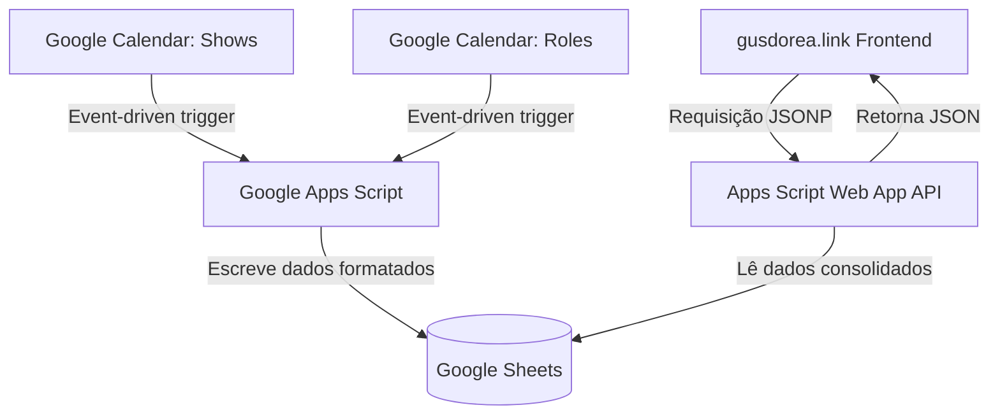

# Gus Dorea Linktree — Contexto do Projeto para LLMs

Este documento serve como o manual definitivo do projeto para agentes de IA (LLMs) e desenvolvedores. Ele resume o fluxo completo, as regras de negócios, a infraestrutura da planilha, as regras de sincronização de calendários e as decisões de renderização do front-end.

---

## 1. Visão Geral do Projeto

O projeto **Gus Dorea Linktree** é um agregador de links pessoal dinâmico (estilo Linktree), hospedado no domínio [gusdorea.link](https://gusdorea.link). 
A página exibe as redes sociais do comediante Gus Dorea, uma lista de shows de stand-up, uma lista de eventos relacionados (roles) e uma seção de links externos relevantes.

### Arquitetura de Fluxo de Dados:

---

## 2. Estrutura do Banco de Dados (Google Sheets)

A planilha Google Sheets atuando como banco de dados deve ter exatamente **5 abas** com os seguintes schemas de cabeçalhos e tipos de dados:

### Aba 1: `config`
Armazena variáveis chave-valor de configuração da página.
* **Colunas:** `key` (String) | `value` (String)
* **Chaves obrigatórias:**
  * `estado`: Controla o layout exibido. Valores aceitos:
    * `auto`: Transiciona automaticamente (Estado B se houver shows, roles ou links futuros; senão Estado A).
    * `A`: Força o Estado A (layout sem show).
    * `B`: Força o Estado B (layout expandido).
  * `name`: Nome do criador (padrão: `Gus Dorea`).
  * `handle`: Identificador social (padrão: `@gusdorea`).
  * `domain`: Domínio da página (padrão: `gusdorea.link`).
  * `bio`: Breve descrição do perfil.
  * `foto_url`: Caminho ou link da foto (padrão: `assets/photos/gus-portrait-smile.jpg`).
  * `titulo_shows`: Rótulo do cabeçalho de Shows (padrão: `shows`).
  * `titulo_roles`: Rótulo do cabeçalho de Roles (padrão: `roles`).
  * `titulo_links`: Rótulo do cabeçalho de Links (padrão: `links`).
  * `rodape`: Texto do copyright no rodapé.

### Aba 2: `socials`
Armazena botões de redes sociais.
* **Colunas:** `icon` (classe de ícone Phosphor, ex: `ph-instagram-logo`) | `label` (String) | `handle` (String) | `href` (URL) | `active` (`true` ou `false`)

### Aba 3: `shows`
Contém as apresentações de stand-up do criador (sincronizadas via calendário principal).
* **Colunas:** `date_iso` (Data YYYY-MM-DD) | `venue` (Nome do local) | `city` (Cidade) | `address` (Endereço) | `time` (Horário formatado, ex: `20h00`) | `href` (Link de ingressos) | `gratis` (`true` ou `false`) | `active` (`true` ou `false`)

### Aba 4: `roles`
Contém outros eventos de comédia que o criador irá participar ou assistir (sincronizados via calendário secundário).
* **Colunas:** `date_iso` (Data YYYY-MM-DD) | `venue` (Nome do local) | `city` (Cidade) | `address` (Endereço) | `time` (Horário formatado) | `href` (Link do evento/detalhes) | `gratis` (`true` ou `false`) | `active` (`true` ou `false`)

### Aba 5: `links`
Contém a lista de links externos e recomendações.
* **Colunas:** `label` (Título do link) | `sub` (Subtítulo ou site de destino) | `href` (URL) | `active` (`true` ou `false`)

---

## 3. Lógica do Google Apps Script (`apps-script.gs`)

O arquivo [apps-script.gs](file:///Users/gustavo/Downloads/Gus%20Linktree/apps-script.gs) contém dois papéis fundamentais: **API de Leitura** e **Motor de Sincronização**.

### API de Leitura (`doGet`):
* Responde a requisições `GET` gerando um payload JSON com as 5 abas consolidadas.
* Suporta o formato **JSONP** (envolvendo a resposta em uma função callback passada no parâmetro da URL `?callback=...`) para evitar restrições de CORS no frontend estático.
* Converte objetos `Date` da planilha de forma segura para strings `YYYY-MM-DD` na resposta da API.

### Sincronização de Calendários:
* **Calendário de Shows:** ID `family01011794322851348615@group.calendar.google.com` (Sincronizado na aba `shows`).
* **Calendário de Roles:** ID `902aa424d4ed371cf3cce30177c47457edce5474e55296120346cf493d3b0e70@group.calendar.google.com` (Sincronizado na aba `roles`).
* **Lógica de Parser de Localização:**
  * O script lê o campo `Location` do evento e tenta mapear automaticamente o nome do lugar (`venue`), o endereço e a cidade (ex: se detectar que a cidade é "São Paulo", substitui a cidade pelo bairro correspondente da localização).
* **Extração de URL e Entrada Gratuita:**
  * Lê a descrição do evento no calendário.
  * Extrai o primeiro link `http/https` presente para ser usado como o `href`.
  * Se encontrar as palavras "grátis" ou "gratuito" (case-insensitive) na descrição, seta o campo `gratis` como `'true'`.
* **Triggers de Execução:**
  * **Triggers em tempo real:** Triggers do tipo `onEventUpdated()` atrelados a ambos os calendários. Sempre que um evento é criado/alterado/deletado no Google Agenda, o Apps Script roda instantaneamente a sincronização para atualizar a planilha em segundos.
  * **Trigger diário de backup:** Roda todo dia às 06h (fuso de São Paulo) para corrigir eventuais falhas de envio de notificações automáticas do calendário.

---

## 4. Lógica de Renderização do Frontend (`site.js`)

O arquivo [site.js](file:///Users/gustavo/Downloads/Gus%20Linktree/site.js) consome o JSON do Apps Script e gerencia a UI dinamicamente.

### Filtro de Eventos Passados:
* Filtra os registros de `shows` e `roles` em tempo real para exibir apenas os eventos em que a data seja **igual ou posterior** à data de hoje (ISO `YYYY-MM-DD`). Eventos passados na planilha são ignorados e não aparecem no site.

### Estados de Renderização da Página:
* **Estado A (Sem shows ativos):**
  * Ativado quando `shows`, `roles` e `links` futuros são nulos.
  * Renderiza as redes sociais em formato de **botões cheios e verticais** contendo o label e o handle (ex: "@gusdorea").
  * Exibe no topo um badge/tag com animação pulsante: `sem show essa semana`.
* **Estado B (Layout expandido):**
  * Ativado automaticamente se houver qualquer show, role ou link ativo futuro.
  * Agrupa as redes sociais no topo como **botões de ícones compactos lado a lado**.
  * Renderiza as seções em ordem vertical: **Shows** -> **Roles** -> **Links**.
  * Cada lista renderiza as datas formatadas em blocos compactos com o dia, dia da semana e mês reduzido.

### Regras Específicas do Badge no Estado B:
* **Dependência estrita do Shows:** O badge no topo (`sem show essa semana` com dot pulsante VS `turnê 2026`) é controlado **apenas** pela existência de shows na aba `shows`.
* Se houver apenas eventos na aba `roles` e nenhum show de stand-up na aba `shows`, a página renderizará no Estado B (exibindo as seções de Roles e Links), mas o badge no topo **obrigatoriamente continuará exibindo a tag** `sem show essa semana`.

---

## 5. Rastreamento e Métricas (Google Analytics 4)

O site dispara eventos customizados para o GA4 via função `track(event, params)`:
* `gus_page_view`: Dispara ao carregar, enviando o `estado` (com_show ou sem_show) e contadores (`shows_count`, `roles_count`).
* `social_click`: Dispara ao clicar em qualquer rede social, enviando o nome da rede (`social_name`) e o estado atual.
* `show_click`: Dispara ao clicar no link de um show, enviando o nome do local (`show_venue`) e a data (`show_date`).
* `role_click`: Dispara ao clicar em um evento secundário, enviando o nome do local (`role_venue`) e a data (`role_date`).
* `link_click`: Dispara ao clicar em links externos, enviando o título do link (`link_label`).
