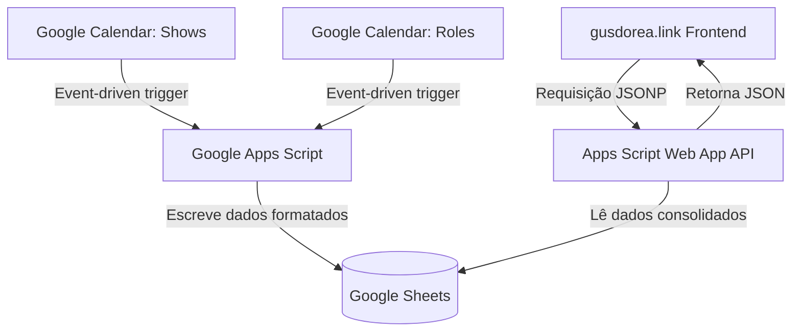

# Gus Dorea Linktree — Contexto do Projeto para LLMs

Este documento serve como o manual definitivo do projeto para agentes de IA (LLMs) e desenvolvedores. Ele resume o fluxo completo, as regras de negócios, a infraestrutura da planilha, as regras de sincronização de calendários e as decisões de renderização do front-end.

---

## 1. Visão Geral do Projeto

O projeto **Gus Dorea Linktree** é um agregador de links pessoal dinâmico (estilo Linktree), hospedado no domínio [gusdorea.link](https://gusdorea.link). 
A página exibe as redes sociais do comediante Gus Dorea, uma lista de shows de stand-up, uma lista de eventos relacionados (roles) e uma seção de links externos relevantes.

### Arquitetura de Fluxo de Dados:


---

## 2. Estrutura do Banco de Dados (Google Sheets)

A planilha Google Sheets atuando como banco de dados deve ter exatamente **5 abas** com os seguintes schemas de cabeçalhos e tipos de dados:

### Aba 1: `config`
Armazena variáveis chave-valor de configuração da página.
* **Colunas:** `key` (String) | `value` (String)
* **Chaves obrigatórias:**
  * `estado`: Controla o layout exibido. Valores aceitos:
    * `auto`: Transiciona automaticamente (Estado B se houver shows, roles ou links futuros; senão Estado A).
    * `A`: Força o Estado A (layout sem show).
    * `B`: Força o Estado B (layout expandido).
  * `name`: Nome do criador (padrão: `Gus Dorea`).
  * `handle`: Identificador social (padrão: `@gusdorea`).
  * `domain`: Domínio da página (padrão: `gusdorea.link`).
  * `bio`: Breve descrição do perfil.
  * `foto_url`: Caminho ou link da foto (padrão: `assets/photos/gus-portrait-smile.jpg`).
  * `titulo_shows`: Rótulo do cabeçalho de Shows (padrão: `shows`).
  * `titulo_roles`: Rótulo do cabeçalho de Roles (padrão: `roles`).
  * `titulo_links`: Rótulo do cabeçalho de Links (padrão: `links`).
  * `rodape`: Texto do copyright no rodapé.

### Aba 2: `socials`
Armazena botões de redes sociais.
* **Colunas:** `icon` (classe de ícone Phosphor, ex: `ph-instagram-logo`) | `label` (String) | `handle` (String) | `href` (URL) | `active` (`true` ou `false`)

### Aba 3: `shows`
Contém as apresentações de stand-up do criador (sincronizadas via calendário principal).
* **Colunas:** `date_iso` (Data YYYY-MM-DD) | `venue` (Nome do local) | `city` (Cidade) | `address` (Endereço) | `time` (Horário formatado, ex: `20h00`) | `href` (Link de ingressos) | `gratis` (`true` ou `false`) | `active` (`true` ou `false`)

### Aba 4: `roles`
Contém outros eventos de comédia que o criador irá participar ou assistir (sincronizados via calendário secundário).
* **Colunas:** `date_iso` (Data YYYY-MM-DD) | `venue` (Nome do local) | `city` (Cidade) | `address` (Endereço) | `time` (Horário formatado) | `href` (Link do evento/detalhes) | `gratis` (`true` ou `false`) | `active` (`true` ou `false`)

### Aba 5: `links`
Contém a lista de links externos e recomendações.
* **Colunas:** `label` (Título do link) | `sub` (Subtítulo ou site de destino) | `href` (URL) | `active` (`true` ou `false`)

---

## 3. Lógica do Google Apps Script (`apps-script.gs`)

O arquivo [apps-script.gs](file:///Users/gustavo/Downloads/Gus%20Linktree/apps-script.gs) contém dois papéis fundamentais: **API de Leitura** e **Motor de Sincronização**.

### API de Leitura (`doGet`):
* Responde a requisições `GET` gerando um payload JSON com as 5 abas consolidadas.
* Suporta o formato **JSONP** (envolvendo a resposta em uma função callback passada no parâmetro da URL `?callback=...`) para evitar restrições de CORS no frontend estático.
* Converte objetos `Date` da planilha de forma segura para strings `YYYY-MM-DD` na resposta da API.

### Sincronização de Calendários:
* **Calendário de Shows:** ID `family01011794322851348615@group.calendar.google.com` (Sincronizado na aba `shows`).
* **Calendário de Roles:** ID `902aa424d4ed371cf3cce30177c47457edce5474e55296120346cf493d3b0e70@group.calendar.google.com` (Sincronizado na aba `roles`).
* **Lógica de Parser de Localização:**
  * O script lê o campo `Location` do evento e tenta mapear automaticamente o nome do lugar (`venue`), o endereço e a cidade (ex: se detectar que a cidade é "São Paulo", substitui a cidade pelo bairro correspondente da localização).
* **Extração de URL e Entrada Gratuita:**
  * Lê a descrição do evento no calendário.
  * Extrai o primeiro link `http/https` presente para ser usado como o `href`.
  * Se encontrar as palavras "grátis" ou "gratuito" (case-insensitive) na descrição, seta o campo `gratis` como `'true'`.
* **Triggers de Execução:**
  * **Triggers em tempo real:** Triggers do tipo `onEventUpdated()` atrelados a ambos os calendários. Sempre que um evento é criado/alterado/deletado no Google Agenda, o Apps Script roda instantaneamente a sincronização para atualizar a planilha em segundos.
  * **Trigger diário de backup:** Roda todo dia às 06h (fuso de São Paulo) para corrigir eventuais falhas de envio de notificações automáticas do calendário.

---

## 4. Lógica de Renderização do Frontend (`site.js`)

O arquivo [site.js](file:///Users/gustavo/Downloads/Gus%20Linktree/site.js) consome o JSON do Apps Script e gerencia a UI dinamicamente.

### Filtro de Eventos Passados:
* Filtra os registros de `shows` e `roles` em tempo real para exibir apenas os eventos em que a data seja **igual ou posterior** à data de hoje (ISO `YYYY-MM-DD`). Eventos passados na planilha são ignorados e não aparecem no site.

### Estados de Renderização da Página:
* **Estado A (Sem shows ativos):**
  * Ativado quando `shows`, `roles` e `links` futuros são nulos.
  * Renderiza as redes sociais em formato de **botões cheios e verticais** contendo o label e o handle (ex: "@gusdorea").
  * Exibe no topo um badge/tag com animação pulsante: `sem show essa semana`.
* **Estado B (Layout expandido):**
  * Ativado automaticamente se houver qualquer show, role ou link ativo futuro.
  * Agrupa as redes sociais no topo como **botões de ícones compactos lado a lado**.
  * Renderiza as seções em ordem vertical: **Shows** -> **Roles** -> **Links**.
  * Cada lista renderiza as datas formatadas em blocos compactos com o dia, dia da semana e mês reduzido.

### Regras Específicas do Badge no Estado B:
* **Dependência estrita do Shows:** O badge no topo (`sem show essa semana` com dot pulsante VS `turnê 2026`) é controlado **apenas** pela existência de shows na aba `shows`.
* Se houver apenas eventos na aba `roles` e nenhum show de stand-up na aba `shows`, a página renderizará no Estado B (exibindo as seções de Roles e Links), mas o badge no topo **obrigatoriamente continuará exibindo a tag** `sem show essa semana`.

---

## 5. Rastreamento e Métricas (Google Analytics 4)

O site dispara eventos customizados para o GA4 via função `track(event, params)`:
* `gus_page_view`: Dispara ao carregar, enviando o `estado` (com_show ou sem_show) e contadores (`shows_count`, `roles_count`).
* `social_click`: Dispara ao clicar em qualquer rede social, enviando o nome da rede (`social_name`) e o estado atual.
* `show_click`: Dispara ao clicar no link de um show, enviando o nome do local (`show_venue`) e a data (`show_date`).
* `role_click`: Dispara ao clicar em um evento secundário, enviando o nome do local (`role_venue`) e a data (`role_date`).
* `link_click`: Dispara ao clicar em links externos, enviando o título do link (`link_label`).

---

## 6. Código Completo do Google Apps Script (`apps-script.gs`)

Para referência rápida de outros agentes de IA ou manutenção, segue a cópia exata do arquivo `apps-script.gs` implantado na sua planilha:

```javascript
/**
 * Gus Dorea Link Page — Google Apps Script
 *
 * Cole este código no Apps Script da sua planilha:
 *   Extensões → Apps Script → cole aqui → Salvar → Implantar
 *
 * Estrutura da planilha (5 abas):
 *   config  → colunas: key | value
 *   socials → colunas: icon | label | handle | href | active
 *   shows   → colunas: date_iso | venue | city | address | time | href | gratis | active
 *   roles   → colunas: date_iso | venue | city | address | time | href | gratis | active
 *   links   → colunas: label | sub | href | active
 */

function doGet(e) {
  const ss = SpreadsheetApp.getActiveSpreadsheet();

  const data = {
    config:  sheetToRows(ss.getSheetByName('config')),
    socials: sheetToRows(ss.getSheetByName('socials')),
    shows:   sheetToRows(ss.getSheetByName('shows')),
    roles:   sheetToRows(ss.getSheetByName('roles')),
    links:   sheetToRows(ss.getSheetByName('links')),
  };

  const json = JSON.stringify(data);

  // Suporte a JSONP (usado pelo site para evitar CORS)
  const callback = e && e.parameter && e.parameter.callback;
  const output = callback
    ? ContentService.createTextOutput(callback + '(' + json + ')').setMimeType(ContentService.MimeType.JAVASCRIPT)
    : ContentService.createTextOutput(json).setMimeType(ContentService.MimeType.JSON);

  return output;
}

function sheetToRows(sheet) {
  if (!sheet) return [];
  const data = sheet.getDataRange().getValues();
  if (data.length < 2) return [];
  const headers = data[0];
  return data.slice(1)
    .filter(row => row.some(v => v !== '' && v !== null && v !== undefined))
    .map(row => {
      const obj = {};
      headers.forEach((h, i) => {
        if (h) obj[String(h)] = formatValue(row[i]);
      });
      return obj;
    });
}

function formatValue(v) {
  if (v instanceof Date) {
    const y = v.getFullYear();
    const m = String(v.getMonth() + 1).padStart(2, '0');
    const d = String(v.getDate()).padStart(2, '0');
    return y + '-' + m + '-' + d;
  }
  return (v !== null && v !== undefined) ? String(v) : '';
}

// ── Sincronização Google Calendars → abas "shows" e "roles" ──────────────────
var CALENDAR_ID = 'family01011794322851348615@group.calendar.google.com';
var ROLES_CALENDAR_ID = '902aa424d4ed371cf3cce30177c47457edce5474e55296120346cf493d3b0e70@group.calendar.google.com';

function syncCalendarToShows() {
  syncCalendarToSheet(CALENDAR_ID, 'shows');
}

function syncCalendarToRoles() {
  syncCalendarToSheet(ROLES_CALENDAR_ID, 'roles');
}

function syncAllCalendars() {
  syncCalendarToShows();
  syncCalendarToRoles();
}

function syncCalendarToSheet(calId, sheetName) {
  var ss = SpreadsheetApp.getActiveSpreadsheet();
  var sheet = ss.getSheetByName(sheetName);
  if (!sheet) return;

  var cal = CalendarApp.getCalendarById(calId);
  if (!cal) { Logger.log('Calendário não encontrado: ' + calId); return; }

  var now = new Date();
  var limite = new Date();
  limite.setMonth(limite.getMonth() + 12);
  var events = cal.getEvents(now, limite);

  var headers = ['date_iso', 'venue', 'city', 'address', 'time', 'href', 'gratis', 'active'];
  var rows = events.map(function(ev) {
    var start = ev.getStartTime();
    var dateISO = Utilities.formatDate(start, 'America/Sao_Paulo', 'yyyy-MM-dd');
    var hora    = Utilities.formatDate(start, 'America/Sao_Paulo', 'HH');
    var min     = Utilities.formatDate(start, 'America/Sao_Paulo', 'mm');
    var timeStr = hora + 'h' + min;
    var loc     = parseLocation(ev.getLocation() || '');
    var desc    = ev.getDescription() || '';
    var href    = extractUrl(desc) || '#';
    var gratis  = /gr[aá]tis|gratuito/i.test(desc) ? 'true' : 'false';
    return [dateISO, ev.getTitle(), loc.city, loc.address, timeStr, href, gratis, 'true'];
  });

  sheet.clearContents();
  sheet.getRange(1, 1, 1, headers.length).setValues([headers]).setFontWeight('bold');
  sheet.setFrozenRows(1);
  if (rows.length > 0) {
    sheet.getRange(2, 1, rows.length, headers.length).setValues(rows);
  }
  Logger.log('Sincronizados ' + rows.length + ' eventos para a aba ' + sheetName + '.');
}

function extractCity(location) {
  if (!location) return '';
  var m = location.match(/-\s*([^,\-]+),\s*([^,]+?)\s*-\s*[A-Z]{2}/);
  if (m) {
    var bairro = m[1].trim();
    var cidade = m[2].trim();
    var cidadeNorm = cidade.toLowerCase().normalize('NFD').replace(/[\u0300-\u036f]/g, '');
    return cidadeNorm === 'sao paulo' ? bairro : cidade;
  }
  var parts = location.split(',');
  return parts.length >= 2 ? parts[parts.length - 2].trim() : location.trim();
}

// Retorna a URL presente na descrição do evento
function extractUrl(text) {
  var m = text.match(/https?:\/\/[^\s<>"]+/);
  return m ? m[0] : null;
}

// Trata localização do Maps
function parseLocation(location) {
  if (!location) return { address: '', city: '' };
  if (!/\s-\s[A-Z]{2}(?:,|\s|$)/.test(location)) {
    return { address: location.split(',')[0].trim(), city: '' };
  }
  var streetMatch = location.match(/(R\.|Rua|Av\.|Avenida|Al\.|Alameda|Trav\.|Travessa|Praça|Pça\.|Est\.|Estrada|Rod\.|Rodovia|Largo|Beco)/i);
  var venueName = '';
  if (streetMatch && streetMatch.index > 0) {
    venueName = location.substring(0, streetMatch.index).replace(/,\s*$/, '').trim();
  }
  var city = extractCity(location);
  return venueName
    ? { address: venueName, city: city }
    : { address: extractStreet(location), city: city };
}

function extractStreet(location) {
  if (!location) return '';
  var m = location.match(/((?:R\.|Rua|Av\.|Avenida|Al\.|Alameda|Trav\.|Travessa|Praça|Pça\.|Est\.|Estrada|Rod\.|Rodovia|Largo|Beco)[^,]+,\s*\d+)/i);
  if (m) return m[1].trim();
  return location.split(',')[0].trim();
}

// Configura os triggers imediatos baseados nos eventos dos calendários
function configurarTriggersImediatos() {
  ScriptApp.getProjectTriggers().forEach(function(t) {
    var handler = t.getHandlerFunction();
    if (handler === 'syncCalendarToShows' || handler === 'syncCalendarToRoles' || handler === 'syncAllCalendars') {
      ScriptApp.deleteTrigger(t);
    }
  });

  // 1. Trigger em tempo real para Shows
  ScriptApp.newTrigger('syncCalendarToShows')
    .forUserCalendar(CALENDAR_ID)
    .onEventUpdated()
    .create();

  // 2. Trigger em tempo real para Roles
  ScriptApp.newTrigger('syncCalendarToRoles')
    .forUserCalendar(ROLES_CALENDAR_ID)
    .onEventUpdated()
    .create();

  // 3. Trigger diário como backup às 06h
  ScriptApp.newTrigger('syncAllCalendars')
    .timeBased().atHour(6).everyDays(1).inTimezone('America/Sao_Paulo').create();

  Logger.log('Triggers configurados: Sincronização em tempo real (onEventUpdated) + Backup diário (06h) ativados.');
}
```

